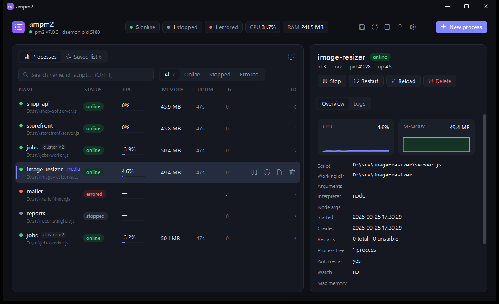
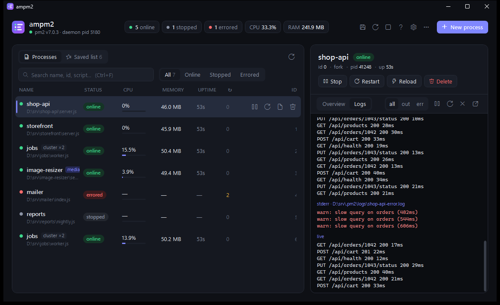
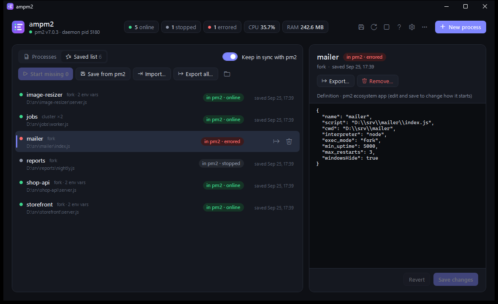
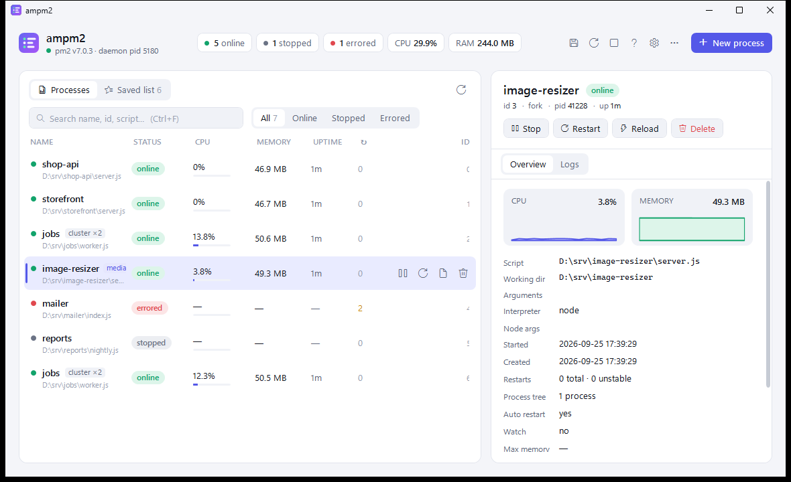
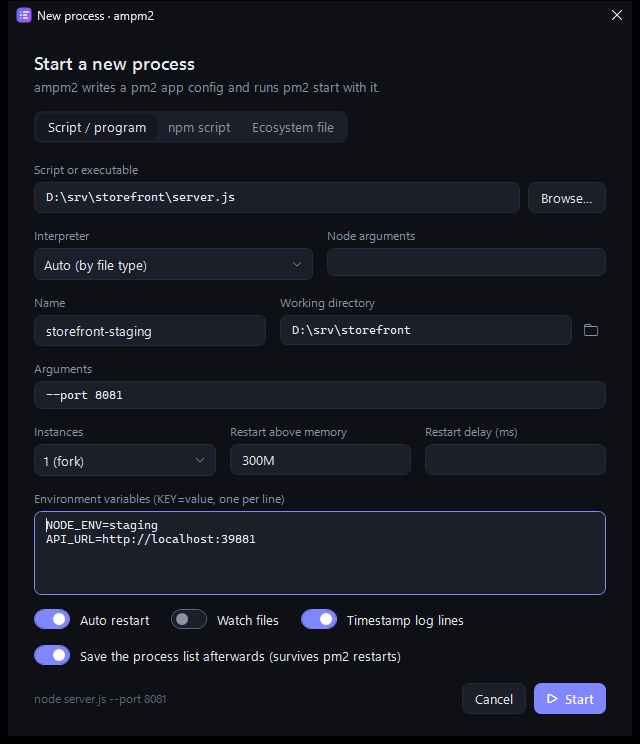
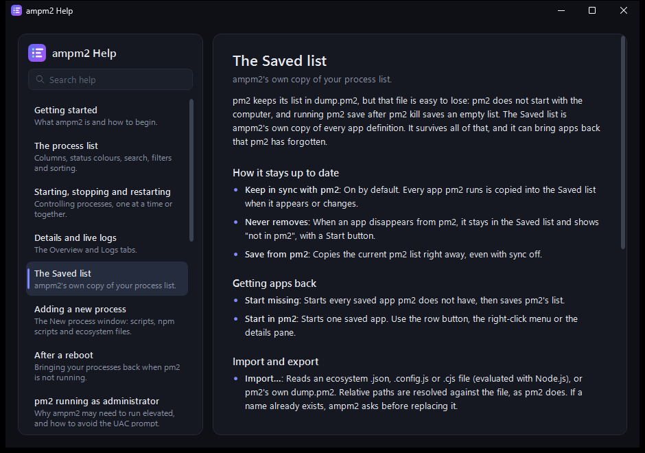
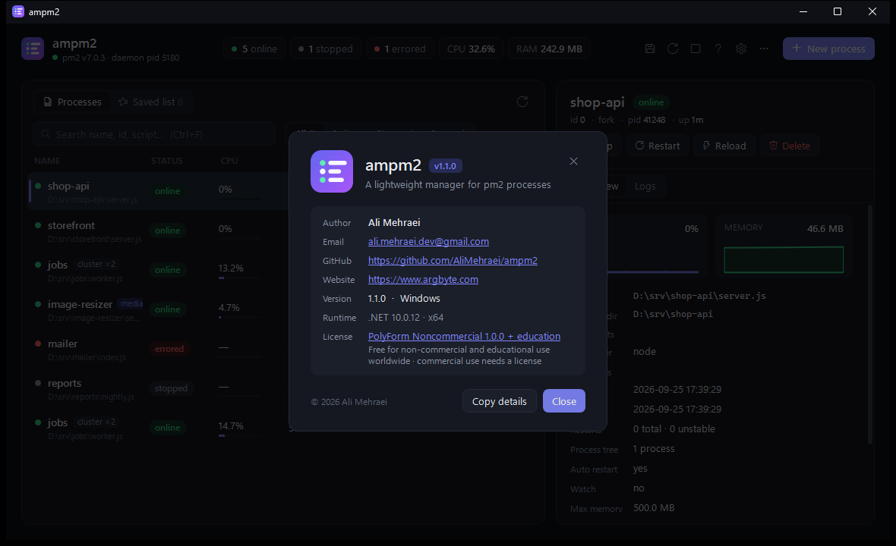

# ampm2

<https://github.com/AliMehraei/ampm2> · <https://www.argbyte.com> · by Ali Mehraei (ali.mehraei.dev@gmail.com) · [PolyForm Noncommercial 1.0.0 + education](LICENSE.md): free for non-commercial and educational use

A small, native desktop app for managing **pm2** on Windows and macOS: see every process with its status,
CPU, memory, uptime and restarts; start, stop, restart, reload, delete and add processes; read live logs; and keep
your own copy of the process list. It lives in the tray (Windows) or the menu bar (macOS).

 no Electron, no web view, no Node runtime of its own.
**[Download the latest release](https://github.com/AliMehraei/ampm2/releases/latest)** · [Help guide](docs/HELP.md) · [Changelog](CHANGELOG.md)



## Screenshots

| | |
|---|---|
|  |  |
| **Live logs:** stdout and stderr with history, the live stream, pause and filters | **Saved list:** ampm2's own copy of your apps, with an editable definition |
|  |  |
| **Light theme:** follows Windows, or pick dark or light | **New process:** a script, an npm script or an ecosystem file, with environment variables |

|  |  |
| **Help:** a searchable guide inside the app (F1 / ⌘?) | **About:** version, author, links and license |

Screenshots show the Windows app with demo services. They are generated by `tools\screenshots.ps1`, which runs a
private pm2 daemon, so your own processes never appear. macOS screenshots will follow.

## Help

The complete guide is built into the app: press **F1** on Windows, **⌘?** on macOS, or click the **?** button.
The same guide is in [docs/HELP.md](docs/HELP.md), generated from the app's help content with
`ampm2 --export-help docs/HELP.md` (the macOS app, which also runs on Windows).

## Install

**Installer** (recommended): `setup\ampm2-setup-<version>.exe`, built with `pwsh .\build-installer.ps1`.
It installs to Program Files with a Start menu entry and an uninstaller, and its **Prerequisites** page checks
the .NET 10 Desktop Runtime, Node.js and pm2. Missing ones are ticked for installation, and you can untick any of them:
.NET from Microsoft, Node.js LTS through winget, pm2 through `npm install -g pm2`. Optional tasks: desktop shortcut,
start hidden in the tray at sign-in.

**Portable**: `pwsh .\build.ps1` builds a self-contained `dist\` (no .NET needed on the machine);
`pwsh .\install.ps1` adds a Start menu shortcut (`-Desktop`, `-Autostart`, `-Uninstall`).

## Saved list: your process list, kept by ampm2

`pm2 save` writes pm2's list to `~/.pm2/dump.pm2`, but pm2 does not start with Windows, and that file is easy to
overwrite with an empty list (`pm2 save` after a `pm2 kill`). So ampm2 keeps **its own copy** in
`%APPDATA%\ampm2\saved-list.json`, a pm2 ecosystem file:

* **Keep in sync with pm2** (on by default): every app pm2 runs is copied in as it appears or changes. Apps that
  disappear from pm2 are **never** removed automatically; they show *not in pm2* with a **Start** button.
* **Start missing** starts every saved app pm2 does not have (`pm2 start` with the saved definitions), then `pm2 save`.
  After a reboot the "pm2 is not running" screen also offers **Start from Saved list**.
* **Import** an ecosystem `.json`, `.config.js` / `.cjs` (evaluated with Node.js), or pm2's `dump.pm2`.
  Relative `cwd` / `script` paths are resolved against the file, as pm2 does.
* **Export** everything or the selection as `ecosystem.json`, usable anywhere with `pm2 start ecosystem.json`.
* Select an app to **edit its definition** (JSON) and save it. Ctrl+S saves while editing.

Only an app's **own** environment variables are saved. pm2 flattens the whole environment (PATH, user profile,
tokens exported in the shell…) into every app, so ampm2 drops variables that equal the system/user environment and
known shell/terminal variables. Apps created with **New process** keep their exact original config.

## After a reboot

pm2 on Windows has no `pm2 startup`, so the daemon is not running after a restart. Open ampm2 and choose
**Start + resurrect** (pm2's own `dump.pm2`) or **Start from Saved list** (ampm2's copy).

If pm2 or Node.js are missing, ampm2 offers to install them (Node.js LTS through winget, pm2 through npm).

## pm2 running as administrator

On Windows pm2 always listens on `\\.\pipe\rpc.sock`, and when the daemon was started from an **elevated**
terminal, Windows lets only elevated programs connect. ampm2 detects this and offers:

* **Relaunch as admin** once, or
* **Relaunch as admin, and don't ask again**: registers a scheduled task `ampm2 (elevated)` so later launches
  go straight to an elevated ampm2 without a UAC prompt. Toggle it in Settings; `install.ps1 -Uninstall` explains removal.

### Stray daemons

Every `pm2 …` command typed in a *non-elevated* terminal while the daemon is elevated spawns a new
`Daemon.js` that can never bind the pipe and never exits (about 40–50 MB each). ampm2 finds them (node processes
running `pm2\lib\Daemon.js` that are not the pipe's server and have no children) and shows a banner with **Clean up**.
It only offers this while connected, so it always knows which daemon is the real one.

## Why it is light

| | |
|---|---|
| Talks to pm2 directly | Speaks pm2's own RPC protocol (axon/AMP frames over the named pipe) instead of spawning `pm2 jlist`, which costs a node process (~50 MB, ~0.5 s) per refresh. |
| Metrics are native | CPU and memory come from `GetProcessTimes` / `GetProcessMemoryInfo` over a Toolhelp snapshot, measured per process **tree** (pm2 on Windows often runs the real server as a grandchild). Asking pm2 for metrics makes the daemon spawn WMI/PowerShell every call. |
| Events, not polling | Status changes and log lines arrive over pm2's event bus (`pub.sock`). The full list is only re-read on events, and on a slow backstop timer (default 60 s). |
| Idle when hidden | Sampling stops when the window is hidden or minimized, and the working set is trimmed. |
| Software rendering | ~50 MB less private memory than WPF's D3D path (switchable in Settings). |

Measured on this machine (4 pm2 apps, published build):

| state | CPU | private memory | working set |
|---|---|---|---|
| visible, 2 s sampling | ~2 % of one core | ~68 MB | ~118 MB |
| hidden in tray | 0 | ~67 MB | ~16 MB |

## Features

* Process list with status pills, CPU bar, memory, uptime, restarts, cluster/namespace badges, search, status filters, sorting.
* Row actions on hover, right-click menu, multi-select bulk actions (Ctrl/Shift-click), keyboard: `F5` refresh, `Ctrl+N` new,
  `Ctrl+R` restart, `Ctrl+S` save, `Ctrl+L` logs, `Ctrl+F` search, `Del` delete, `Enter` logs.
* Detail pane: live CPU/memory sparklines, script, cwd, args, interpreter, log paths (open in Explorer), versions.
* Logs: tail of stdout/stderr files plus the live stream, `all / out / err`, pause, copy (`Ctrl+C`), open file.
* New process: script or program (auto interpreter), **npm script** (runs `npm-cli.js run <script>`, which works on Windows,
  unlike pm2 + `npm.cmd`), or ecosystem file. Name, cwd, args, instances/cluster, max memory restart, restart delay, env vars,
  watch, auto restart, timestamps. ampm2 writes the app config to `%APPDATA%\ampm2\apps\<name>.json` and runs `pm2 start` with it.
* Save / resurrect / flush logs / kill daemon / start daemon.
* Tray icon with a status badge (red = something errored), tray menu, single instance, dark/light/system theme.
* Built-in, searchable help guide (F1 / ⌘?), with "Learn more" links from the screens that need explaining.

Destructive dialogs open with **Cancel** focused, and Enter only presses the focused button: a keystroke meant
for another window can never confirm a delete.

## Layout

```
src/Ampm2.Core/     shared, UI-free (Windows + macOS + Linux)
  Pm2/              Amp framing · PipeConnection (named pipe on Windows, Unix socket elsewhere) · Pm2Rpc · Pm2Bus
                    Pm2Cli (pm2/npm/node discovery; login-shell PATH on macOS) · Pm2Process
  Sys/              AppLibrary (Saved list) · NewAppSpec · ProcessMetrics (Windows) · UnixProcessMetrics (ps)
                    DataPaths · Pm2Endpoints · SelfTest · Text helpers
  Help/             HelpContent: the in-app help guide for both apps, also exported to docs/HELP.md
  AppInfo.cs        name, version, author, email, website, GitHub URL, license: shown in both About sections
src/Ampm2/          Windows app (WPF): tray, UAC/elevated task, stray-daemon cleanup, installer target
src/Ampm2.Mac/      macOS app (Avalonia 12): menu bar icon, app menu, same views and features
installer/          Inno Setup script (Windows)
tools/              test-daemon.js · test-pm2.cmd/js · test-apps/ · wsl-test.sh · mac-bundle.py · capture.ps1
```

## macOS

```powershell
pwsh .\build-mac.ps1      # from Windows: mac\ampm2-<version>-macos-arm64.zip and -x64.zip
```
```bash
./build-mac.sh            # on a Mac: .app + .dmg, ad-hoc or SIGN_ID="Developer ID Application: …"
```

Each zip holds a self-contained `ampm2.app` (no .NET needed), ad-hoc signed with
[rcodesign](https://github.com/indygreg/apple-platform-rs) so Apple Silicon runs it. It is not notarized, so the first
launch needs `xattr -dr com.apple.quarantine /Applications/ampm2.app` or *Privacy & Security > Open Anyway*
(see `tools/README-mac.txt`, copied next to the zips). macOS 14 or newer.

On macOS pm2 listens on Unix sockets in `~/.pm2` (or `$PM2_HOME`). A Finder-launched app gets a minimal PATH, so ampm2
reads your login shell's environment once, which finds Homebrew / nvm / volta installs of node and pm2.
There is no UAC and no stray-daemon problem on macOS; if pm2 was started with `sudo`, ampm2 explains that it cannot reach it.
Data lives in `~/Library/Application Support/ampm2/`.

## About

Both apps have an About section (Windows: ⋯ menu, Settings footer, tray menu; macOS: app menu ▸ About ampm2, ⓘ button,
menu bar icon) with the author, e-mail, version, platform and runtime, and **Copy details** for bug reports.
Its text, including the GitHub link, comes from `src/Ampm2.Core/AppInfo.cs`.

## Testing without touching your pm2

pm2 hard-codes the pipe names on Windows, so `tools\test-daemon.js` runs a **real** pm2 daemon (your installed
version) on private pipes with sample apps (an API, a 2-instance cluster worker, a crasher that ends up errored,
a stopped app):

```powershell
node tools\test-daemon.js                       # leave running
$env:AMPM2_RPC_PIPE='ampm2-test-rpc.sock'; $env:AMPM2_PUB_PIPE='ampm2-test-pub.sock'
$env:AMPM2_PM2='D:\Projects\ampm2\tools\test-pm2.cmd'   # pm2 CLI shim for the test pipes (Add/Save/Flush)
.\dist\ampm2.exe --selftest report.txt          # protocol self-test; AMPM2_SELFTEST_ACTIONS=1 also stops/starts/restarts/deletes
.\dist\ampm2.exe --show                         # the UI against the test daemon
New-Item "$env:TEMP\ampm2-test-pm2\stop"        # ends the test daemon and its apps
```

With the pipes overridden and no `AMPM2_PM2`, ampm2 refuses CLI actions, so a test session can never reach the real daemon.
**Unix code path** (Unix sockets, peer pid, `ps` metrics, login-shell PATH), against a real pm2 on Linux in WSL:

```powershell
wsl bash /mnt/d/Projects/ampm2/tools/wsl-test.sh        # `... clean` removes ~/.ampm2-test
```

The macOS app also runs on Windows (`src\Ampm2.Mac\bin\Release\net10.0\ampm2.exe`), which is how its UI is tested
without a Mac, and `ampm2 --selftest report.txt` works headless in both apps.

Set `AMPM2_PROFILE=test` as well to run a test copy next to your real ampm2: it gets its own data folder
(`%APPDATA%\ampm2-test`) and its own single-instance lock. With `AMPM2_SELFTEST_ACTIONS=1` the self-test also deletes an app from pm2
and restores it from the Saved list.

## License

Copyright (c) 2026 Ali Mehraei.

ampm2 is **source-available, not open source for commercial use**. It is licensed under the
[PolyForm Noncommercial License 1.0.0](LICENSE.md), with an additional permission for education worldwide:

| | |
|---|---|
| Personal use, study, hobby projects, testing | allowed |
| Schools, colleges, universities and educational institutes, anywhere in the world, public or private, for teaching, learning and research | allowed |
| Individuals using it for education: learning, teaching, tutoring, courses, workshops, research | allowed |
| Charities, public research organizations and government bodies | allowed |
| Changing it and sharing your changes, for non-commercial use | allowed, keep `LICENSE.md` and its Required Notice |
| Any commercial use, including inside a company or as part of a paid product or service | **needs a commercial license** |

For a commercial license, contact **ali.mehraei.dev@gmail.com**.
